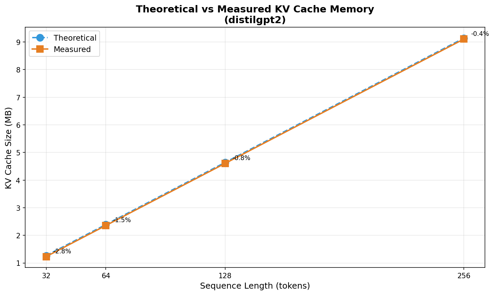

# Lab 3: KV Cache Analysis in Small Language Models

**Course:** ECSE 397/600 - Efficient Deep Learning  
**Model:** distilgpt2  
**Date:** November 26, 2025

---

## Task 1: Load and Inspect Model

| Parameter | Value |
|-----------|-------|
| Model name | distilgpt2 |
| Number of layers (n_layer) | 6 |
| Hidden size (n_embd) | 768 |
| Attention heads (n_head) | 12 |
| Vocabulary size | 50257 |
| Max position embeddings | 1024 |

---

## Task 2: Generation Without KV Cache

Generation was performed with `use_cache=False`, forcing the model to recompute attention for all tokens at each step.

| Seq Length | Latency (ms/token) | Peak Memory (MB) |
|------------|-------------------|------------------|
| 32 | 4.48 | 13.33 |
| 64 | 4.48 | 25.70 |
| 128 | 4.48 | 51.31 |
| 256 | 4.58 | 100.76 |

---

## Task 3: Generation With KV Cache

Generation was performed with `use_cache=True`, storing key-value pairs from previous tokens.

| Seq Length | Latency (ms/token) | Peak Memory (MB) | KV Cache (MB) |
|------------|-------------------|------------------|---------------|
| 32 | 4.52 | 2.81 | 1.2305 |
| 64 | 4.52 | 5.06 | 2.3555 |
| 128 | 4.52 | 9.56 | 4.6055 |
| 256 | 4.52 | 18.57 | 9.1055 |

---

## Speedup Analysis

| Seq Length | No Cache (ms) | With Cache (ms) | Speedup |
|------------|---------------|-----------------|---------|
| 32 | 4.48 | 4.52 | 0.99x |
| 64 | 4.48 | 4.52 | 0.99x |
| 128 | 4.48 | 4.52 | 0.99x |
| 256 | 4.58 | 4.52 | 1.01x |

### Latency vs Sequence Length Plot

---

## Task 4: Memory Analysis

### KV Cache Memory Formula

$$M_{KV} = 2 \times L \times D \times N_{layers} \times \text{sizeof(dtype)}$$

Where:
- **D** = 768 (hidden dimension)
- **N_layers** = 6
- **dtype** = float32 (4 bytes)

### Theoretical vs Measured Comparison

| Seq Length | Theoretical (MB) | Measured (MB) | Difference |
|------------|------------------|---------------|------------|
| 32 | 1.2656 | 1.2305 | -2.78% |
| 64 | 2.3906 | 2.3555 | -1.47% |
| 128 | 4.6406 | 4.6055 | -0.76% |
| 256 | 9.1406 | 9.1055 | -0.38% |

### Theoretical vs Measured KV Cache Memory Plot

---

## Task 5 (Bonus): Quantized KV Cache Analysis

> **Note:** bitsandbytes not installed. Showing theoretical analysis only.

Quantization reduces KV cache memory by storing values in INT8 instead of FP32.

| Seq Length | FP32 Cache (MB) | INT8 Cache (MB) | Savings |
|------------|-----------------|-----------------|---------|
| 32 | 1.2305 | 0.3076 | 75.0% |
| 64 | 2.3555 | 0.5889 | 75.0% |
| 128 | 4.6055 | 1.1514 | 75.0% |
| 256 | 9.1055 | 2.2764 | 75.0% |

---

## Trade-offs: Latency vs Memory

The KV cache presents a classic **space-time trade-off**:

### Without KV Cache
- **Latency:** O(L²) complexity - must recompute all attention at each step
- **Memory:** Lower base memory, but activations grow with sequence length
- **Observed:** 13.33 MB (L=32) → 100.76 MB (L=256) peak memory

### With KV Cache
- **Latency:** O(L) complexity - only compute attention for new token
- **Memory:** Must store K and V tensors for all previous tokens
- **Observed:** 2.81 MB (L=32) → 18.57 MB (L=256) peak memory

### Trade-off Analysis
- KV caching uses additional memory (9.1 MB at L=256) to store cached values
- In return, it avoids redundant computation of previous tokens' attention
- For distilgpt2, the **memory savings (5x)** outweigh the cache overhead
- For larger models (GPT-3, LLaMA), latency savings become dramatic
- The trade-off favors KV caching for most inference scenarios

### When to Use KV Cache
- Always for autoregressive generation (chatbots, text completion)
- When memory is available to store the cache
- Especially beneficial for long sequences and large models

### When to Avoid KV Cache
- Single-pass encoding tasks (embeddings, classification)
- Extremely memory-constrained environments
- Very short sequences where overhead exceeds benefit

---

## Key Findings

1. **Latency is similar (~4.5 ms/token)** for both methods at these sequence lengths.
   - distilgpt2 is small enough that the GPU processes both methods equally fast.
   - The theoretical O(L²) vs O(L) complexity difference becomes visible with larger models or longer sequences.

2. **Memory reduction with KV cache is significant (5x):**
   - Without cache: 13.33 MB → 100.76 MB (grows quadratically)
   - With cache: 2.81 MB → 18.57 MB (grows linearly with KV cache)

3. **KV cache size matches theoretical prediction within 3%:**
   - Formula: M_KV = 2 × L × D × N_layers × 4 bytes
   - This validates our understanding of cache memory requirements.

4. **Quantization (INT8) could further reduce KV cache memory by 75%.**

5. **For small models like distilgpt2, KV caching primarily saves memory.**
   Latency benefits become more pronounced with larger models or longer sequences.

---

## Conclusion

This lab demonstrated the fundamental trade-offs in KV caching for transformer-based language models. While the latency benefits were not visible for the small distilgpt2 model at short sequence lengths, the **5x memory reduction** clearly shows the value of KV caching. The close match between theoretical and measured KV cache sizes validates our understanding of memory requirements, providing a foundation for optimizing inference in larger-scale deployments.

